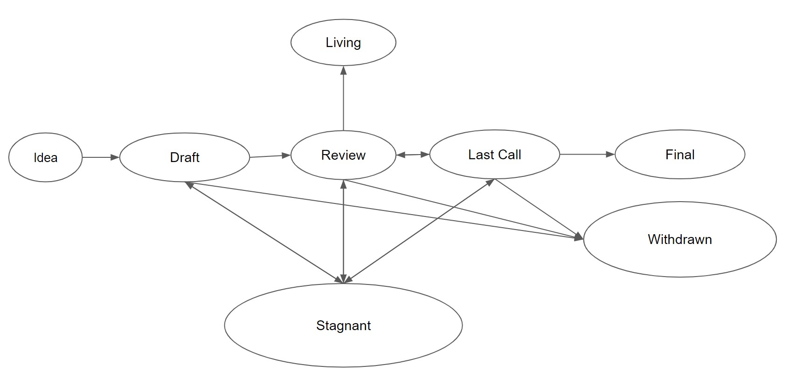

  <h1 align="center">SNIPs</h1>
  

    
    
       
  <a href="https://github.com/starknet-community-libs/SNIPs/issues/new?assignees=&labels=bug&template=01_BUG_REPORT.md&title=bug%3A+">Report a Bug</a>
  -
  <a href="https://github.com/starknet-community-libs/SNIPs/issues/new?assignees=&labels=enhancement&template=02_FEATURE_REQUEST.md&title=feat%3A+">Request a Feature</a>
  -
  <a href="https://github.com/starknet-community-libs/SNIPs/discussions">Ask a Question</a>       
  

  
  <h3 align="center">StarkNet Improvement Proposal repository.</h3>

 

Table of Contents

- [About](#about)
- [Support](#support)
- [Project assistance](#project-assistance)
- [Contributing](#contributing)
- [Authors & contributors](#authors--contributors)
- [Security](#security)
- [License](#license)
- [Acknowledgements](#acknowledgements)

## About

The goal of the SNIP project is to document standardized protocols for StarkNet related softwares and to document them in a high quality and implementable way.

## SNIP Process

### Overview

The SNIP process is the process that a contributor goes through to propose a change to the StarkNet ecosystem. It is inspired by the [EIP process](https://eips.ethereum.org/EIPS/eip-1).

Here is the process that a contributor should follow:

1. Review [SNIP-1](./SNIPS/snip-1.md).
2. Fork the repository by clicking "Fork" in the top right.
3. Add your SNIP to your fork of the repository. There is a [template SNIP here](./SNIPS/snip-template.md).
4. Submit a Pull Request to [SNIPs repository](https://github.com/starknet-community-libs/SNIPs)

Your first PR should be a first draft of the final SNIP. It must meet the formatting criteria enforced by the build (largely, correct metadata in the header). An editor will manually review the first PR for a new SNIP and assign it a number before merging it. Make sure you include a `discussions-to` header with the URL to a discussion forum or open GitHub issue where people can discuss the SNIP as a whole.

### SNIP life cycle

Once a SNIP is merged, it is considered `Draft`. The SNIP author may then continue to work on the SNIP, gathering feedback and making changes. The SNIP author can request a review from the SNIP editors by adding the `review-requested` label to the PR. The SNIP editors will review the PR and either approve it, request changes, or close it with an explanation. For a SNIP to be `Accepted` it must meet certain minimum criteria. It must be a clear and complete description of the proposed enhancement. The enhancement must represent a net improvement. The proposed implementation, if applicable, must be solid and must not complicate the protocol unduly.

Once a SNIP has been `Accepted`, the reference implementation must be completed. When the reference implementation is complete and incorporated into the main source code repository, the status will be changed to `Final`.

To update a `Draft` SNIP, the author can submit a PR making the required changes. Note that, because the SNIPs are stored as markdown files in a versioned repository, there is no particular advantage to updating the version of a SNIP. In particular, the SNIP editors don't have to list the `Draft` SNIPs, they can just list the `Final` SNIPs.

Lifecycle overview:

## Support

Reach out to the maintainer at one of the following places:

- [GitHub Discussions](https://github.com/abdelhamidbakhta/SNIPs/discussions)
- Contact options listed on [this GitHub profile](https://github.com/abdelhamidbakhta)

## Project assistance

If you want to say **thank you** or/and support active development of SNIPs:

- Add a [GitHub Star](https://github.com/starknet-community-libs/SNIPs) to the project.
- Tweet about the SNIPs.
- Write interesting articles about the project on [Dev.to](https://dev.to/), [Medium](https://medium.com/) or your personal blog.

Together, we can make SNIPs **better**!

## Contributing

First off, thanks for taking the time to contribute! Contributions are what make the open-source community such an amazing place to learn, inspire, and create. Any contributions you make will benefit everybody else and are **greatly appreciated**.

Please read [our contribution guidelines](docs/CONTRIBUTING.md), and thank you for being involved!

## Authors & contributors

For a full list of all authors and contributors, see [the contributors page](https://github.com/starknet-community-libs/SNIPs/contributors).

## Security

SNIPs follows good practices of security, but 100% security cannot be assured.
SNIPs is provided **"as is"** without any **warranty**. Use at your own risk.

_For more information and to report security issues, please refer to our [security documentation](docs/SECURITY.md)._

## License

This project is licensed under the **MIT license**.

See [LICENSE](LICENSE) for more information.

## Acknowledgements

The SNIPs repository was heavily inspired by [EIPs](https://github.com/ethereum/EIPs).

Shout out to all EIP editors and active contributors.
